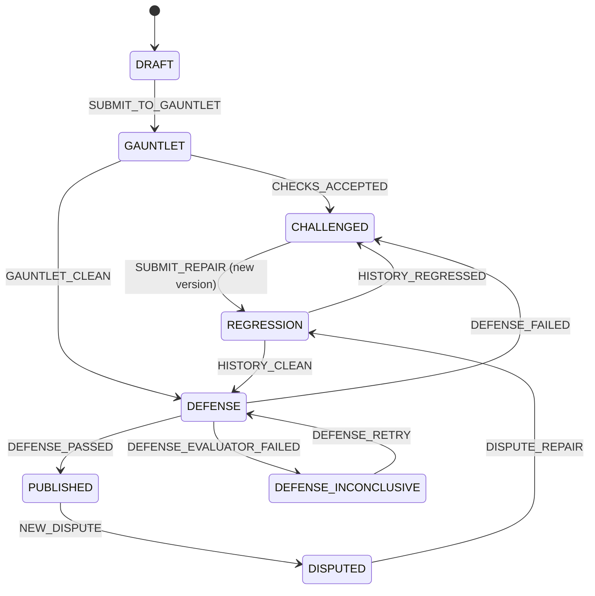

<div align="center">

# ⚒️ LA FORJA

### *Getting the right answer is not enough. Forge it, attack it, defend it.*

**An adversarial learning studio for high-school and college mathematics.**
Students author exam questions. GPT-5.6 attacks them with evidence.
Only what survives a repair, a written defense and a full re-run of its
check history gets published — with an auditable passport.

[](https://github.com/manuelpenazuniga/LaForja/actions/workflows/ci.yml)


**[▶ Live demo](https://la-forja-edu.vercel.app)** · **[🎬 Demo video](https://vimeo.com/1211846755)** · OpenAI Build Week — **Education track**

</div>

---

## The idea in 30 seconds

Every AI tutor on the market optimizes the same thing: getting the student to an
answer, faster. LA FORJA inverts the loop. The student does the authoring — a
multiple-choice item, distractors designed around real misconceptions, a written
rationale — and the AI does the attacking:

1. **Three concurrent GPT-5.6 reviewers** hunt for ambiguity, factual errors and
   weak distractors, each bound to an explicit **evidence contract**. A finding
   without evidence is labeled a *hypothesis*, never a defect.
2. An accepted counterexample **forces a repair** — always a new version, never a
   silent edit.
3. Every new version **re-runs the full check history** before it can publish.
4. The student then **defends the item in writing**, scored against an explicit
   3-dimension rubric.
5. What publishes carries a **passport**: provenance, license, every accepted
   attack with its counterexample, every re-run result, the rubric — the whole
   audit trail.

> **The AI's role, stated exactly:** the AI does not generate the initial item and
> does not hand over a canonical solution to copy. It returns challenges and
> evidence — the repair and the defense belong to the student.

The mechanism is **exam-agnostic**: it was designed against the constraints of a
real high-stakes exam — that is where the assessment expertise comes from — and
deliberately built to carry no dependency on any single country, exam or examining
body. The demo discipline is **probability**, universal at this level and small
enough for a bounded, reproducible solver to verify.

---

## ⚡ Try it — no account, no setup

**Live demo: <https://la-forja-edu.vercel.app>**

Open it — the landing page explains the whole loop — and press **"Enter the
studio"**. A short first-visit onboarding hands you the one move that matters:
**"Load the demo challenge"**. You get a deliberately defective original item —
the classic two-children problem:

> *"A family has two children. It is known that **one of them is a boy**. What is
> the probability that both children are boys?"* — author's key: **1/3**

The planted defect is ambiguity, and it is a real one: read "at least one is a
boy" and the answer is **1/3**; read "a specific child is a boy" and it is
**1/2**. Two readings, two answers — a reproducible counterexample, not an
opinion. Your job is to repair the stem so only one reading survives, then defend
the repair.

Every visitor gets an **isolated session** (httpOnly cookie, auto-reset, rate
limited, zero PII) against a hosted database — one judge cannot break another
judge's demo. The studio, the seeded item, versioning and passports run on the
live deployment today; the reviewer stage needs a live `OPENAI_API_KEY` at
runtime, and the UI states plainly whether model calls are available rather than
faking them (see [Status](#-status-read-this-before-judging)).

Local setup is five commands — see [Run it locally](#-run-it-locally).

---

## 🔥 How it works

```text
Original item + author rationale
              │
              ▼
   Explicit parallel orchestration (own code, NDJSON streamed to the UI)
     ├─ Responses call: ambiguity reviewer      ┐
     ├─ Responses call: discipline reviewer     ├─ Promise.allSettled
     │            + bounded solver verification │  + per-reviewer timeout
     └─ Responses call: distractor reviewer     ┘
              │
              ▼
   Zod schema validation → deterministic item probes
              │
              ▼
       Separate adjudication step (validates contracts, deduplicates,
              │                    assigns status, abstains on the unverifiable)
              ▼
 accepted check → repair (v2) → FULL history re-run
              │
              ▼
 written defense → rubric → item passport → PUBLISHED
```

### The lifecycle is a real state machine

Eight states, twelve approved transitions, nothing else — `src/core/stateMachine.ts`,
with all 96 state/event pairs asserted in tests (the 84 illegal ones are pinned as
illegal, not merely undocumented):



A repair is always a **new `ItemVersion`**; published versions are **immutable**.
If the defense evaluator itself fails, the outcome is `DEFENSE_INCONCLUSIVE` —
returned as a readable result, never a 500 and never an auto-reject.

### Three check classes, three different promises

| Class | Example | What is guaranteed |
|---|---|---|
| **Deterministic** | schema invariants, solver recomputation, fixed-threshold probes | **Strict non-regression** — v2 cannot reintroduce the failure |
| **Re-executable counterexample** | a concrete interpretation and the answer it yields | The construction is **re-executed** on v2; if it still holds, the version does not publish |
| **Semantic judgment** | plausibility of a distractor | **Re-adjudicated** on every version; never described as an absolute guarantee; visible in the passport |

The guarantee, in its only authorized wording:

> Every accepted check is re-run on each new version. The system guarantees
> execution of the history and non-regression of deterministic invariants;
> semantic judgments are re-adjudicated and remain visible in the passport.

The history re-run engine (`src/core/checks.ts`) is **fail-closed**: an
inconclusive re-run, an aborted batch or a batch-accounting mismatch blocks
publication instead of failing open.

### Evidence contracts — "the model said so" is never final evidence

- **Ambiguity** is valid only if `answer_a !== answer_b` — two interpretations
  that produce the *same* answer are not a defect.
- A **discipline** verdict of `correct` requires a full citation: `source_id`,
  version/date, license, excerpt and relevance. A bare URL is not enough; an
  insufficient source yields `unverified`, never `correct`. Probability claims
  are additionally recomputed by a **bounded solver** (`src/solver/probability.ts`)
  that returns exact reduced fractions with a reasoning trace — and honestly
  answers `unsupported` outside its scope.
- **Distractor** findings without evidence are labeled **hypothesis**.
- A **separate adjudication step** — deliberately *not* called independent:
  reviewer and adjudicator are both GPT-5.6 models, and that correlated-error
  risk is declared, not hidden — validates each finding against its contract,
  deduplicates, assigns status, and **abstains** on what it cannot verify.

### The written defense

Two written questions, three observable dimensions (*identifies the error*,
*explains uniqueness of the correct option*, *answers a variation*), each scored
0–2 with textual evidence. Publication needs **≥ 4/6 with no dimension at 0**.

---

## 🤖 Built with Codex · Runs on GPT-5.6

*This section is part of the submission: how Codex and GPT-5.6 contributed, and
where the human decisions were.*

### The collaboration, honestly

We drew a hard ownership line and kept it all week:

- **Human + Claude — the contracts.** Product decisions, the check taxonomy and
  its three promises, the state/event vocabulary, every Zod schema, the reviewer
  prompt text, the rubric, the compliance policy, the demo-isolation design, the
  test skeletons, tooling, CI and docs.
- **Codex — every core internal.** Each implementation point carried a precise
  in-place spec comment (`TODO(codex): what, inputs, invariants, failure
  behaviour`) and a fully written test suite waiting under `describe.skip`.
  Codex's job was to fill the body and delete the `.skip` — the tests then had to
  pass for real, and no assertion was ever weakened to make that happen.

That workflow is what Codex accelerated most: with contracts, schemas and
executable specs already pinned, Codex implemented the state machine reducer, the
bounded probability solver, the deterministic item probe, the fail-closed history
re-run engine, the model-call wrapper, all three reviewers, the streaming
orchestrator, the adjudication step, the defense generation and scoring, the
passport builder and the eval runner — and the suite that had been waiting for
each of them went green: **1054 tests passing across 28 files, 0 skipped**, with
`tsc --noEmit` clean under `strict` and `noUncheckedIndexedAccess`.

**/feedback Codex Session ID:** `<PLACEHOLDER — filled in the Devpost submission form>`

The dated, small-commit history of this repository is the build evidence: the
entire codebase was written inside the submission window (July 13–21), most of it
on July 21, in slice-sized commits.

### GPT-5.6, and only GPT-5.6

The runtime speaks to **OpenAI gpt-5.6 models exclusively** — no fallback, no
"just for dev" exception. Defaults: `REVIEWER_MODEL=gpt-5.6-terra`,
`ADJUDICATOR_MODEL=gpt-5.6-sol`. Model IDs are never hardcoded; they come from
env through `src/config/models.ts`, which enforces a **fail-closed exact
allowlist** (`gpt-5.6`, `gpt-5.6-terra`, `gpt-5.6-sol` — deliberately not a
prefix test, which an arbitrary suffix could smuggle past) behind four gates:

| Gate | Where | Behaviour |
|---|---|---|
| `evaluateModels` | pure | computes compliance + offending IDs |
| `loadModelConfig` | startup | warns loudly, never blocks boot; flag persisted on every run and call |
| `assertRuntimeCompliance` | the model-call boundary | **throws** with the exact ID about to be dispatched — enforced again *inside* the transport, so even a direct caller of the exported transport meets the allowlist |
| `assertEvalCompliance` | the eval runner | **throws** before any artifact is written; recomputes compliance from the IDs embedded in the report itself and never trusts a `compliance` flag it was handed |

Every model call is Zod-validated, retried once, then fails readably — and logs
the exact model ID the API echoed back, latency, tokens, prompt version and
prompt hash (`ModelCall` in `prisma/schema.prisma`). Partial reviewer failure
degrades the result instead of breaking the session (`Promise.allSettled` +
per-reviewer timeout).

**Item text is untrusted input.** It is delimited in every prompt
(`delimitItem`, `GUARDRAIL_PREAMBLE`), reviewers get **no tools and no network**,
input size is capped and rate-limited per session, and a delimiter-injection test
suite pins the behaviour.

---

## 🚦 Status — read this before judging

The project language rule is symmetric and strictly enforced: present tense only
for what runs today, and implemented work is never understated either.

**What runs today** — the complete backend and studio: state machine, four
bounded discipline solvers (probability, statistics, triangle similarity,
geometry), item probe, fail-closed history re-run, model-call wrapper, all three
reviewers, streaming orchestration, adjudication, defense generation and rubric
scoring, passport assembly, the eval runner, all six API routes, the assay-sheet
UI, and the isolated live deployment on Vercel + Turso. All of it is exercised by
the test suite — 1054 passing, 0 skipped.

**Real GPT-5.6 calls run end to end.** `openaiTransport` in
`src/openai/client.ts` — the network hop — is implemented; no `TODO(codex)` stub
remains. Behind its injectable `ModelTransport` seam, everything around it
(validation, retry-once, timeouts, compliance gates, telemetry, orchestration,
adjudication, scoring, the eval harness) is implemented and also verified offline
against fake transports. The full pipeline — three concurrent reviewers, the
separate adjudication step, the solver-grounded discipline verdict, defense
scoring, the passport — completes against live **gpt-5.6-terra** (reviewers) and
**gpt-5.6-sol** (adjudicator), verified on the seeded demo items and the labeled
smoke set.

**The eval has run** — real numbers, in [`eval/results/`](./eval/results). On the
14 holdout items, exact counts across three runs each: the single-reviewer
baseline finds all 12 planted defects but flags both clean items (2 false
positives); the three specialists *without* adjudication find 10–12 but with 7–8
false positives; the full gauntlet *with* adjudication finds 6–7 with 0–1 false
positives. The separate adjudication step is doing exactly its job — trading some
recall for a large precision gain. An injectable seam proves the wiring; these
runs show what GPT-5.6 actually does to a defective item.

---

## 📊 Evals — reproducible by design, honest about the numbers

The eval harness (`npm run eval`, `src/eval/run.ts`) is implemented, tested, and
**has run** against live gpt-5.6 — the artifacts are in `eval/results/`.

- **Labeled smoke set** — 28 team-authored original items: 7 clean (the
  false-positive floor), 7 ambiguous, 7 with a factual error and a source, 7 with
  cue leak / weak distractors. The original 16 are probability; a balanced 12-item
  block adds statistics, triangle similarity and geometry (one per category per
  discipline). Declared **author-labeled**: the same team designed the defects and
  the labels, so it is never called a gold set. The arithmetic of every labeled
  answer is cross-checked against the bounded solver in tests.
- **Dev/holdout split** (14/14): dev items develop prompts and are never reported
  as evaluation; holdout is what gets reported.
- **Three configurations × 3 runs each**, identical settings: `general-reviewer`
  (single-reviewer baseline), `gauntlet` (three specialists + adjudication),
  `gauntlet-no-adjudication`.
- **Exact counts, never grandiose percentages** — "found 13 of 16 in run 1…" —
  plus false positives on clean items, citation precision, schema-valid counts,
  p50/p95 latency and cost per item. Raw JSON, prompt hash, exact model IDs and
  timestamps are persisted to `eval/results/`.
- The runner **refuses to write any artifact** whose embedded model IDs are not
  on the gpt-5.6 allowlist — results from another model would be invalid
  evidence, so they never reach disk.

---

## 🛠 Run it locally

Requires Node.js ≥ 20.11.

```bash
git clone https://github.com/manuelpenazuniga/LaForja.git && cd LaForja
npm install
cp .env.example .env.local     # set OPENAI_API_KEY to enable live model calls
npm run db:generate && npm run db:push
npm run db:seed                # seeds the four demo challenges (one per discipline)
npm run dev                    # http://localhost:3000 — landing; the studio is at /studio
```

Verify the build the way CI does:

```bash
npm run typecheck   # tsc --noEmit — clean
npm run test        # vitest — 1054 passing, 0 skipped
npm run secretscan  # also wired as a pre-commit hook
```

Notes so nothing is oversold:

- Without `OPENAI_API_KEY`, everything except the reviewer/defense model calls
  works, and the UI says so instead of pretending. With a key, the calls go
  through `openaiTransport` (`src/openai/client.ts`), which is implemented.
- `npm run eval` makes live gpt-5.6 calls and writes artifacts to `eval/results/`;
  the current run is committed there.
- Local dev and tests use plain SQLite files; production uses Turso (hosted
  libSQL) so serverless instances share one consistent database. The switch is
  automatic on the presence of `TURSO_DATABASE_URL`.

---

## 🧭 What we do NOT claim

This section is binding and survives every future edit.

- **No learning-outcome claim.** Prior literature (protégé effect — Chase et al.
  2009; student-generated questions — PeerWise, n=603, correlational) makes it
  *plausible* that authoring, criticizing and defending questions deepens
  processing. We have not measured it; the declared next step is a study with
  humans.
- **The smoke set is author-labeled**, not independent ground truth.
- **Adjudication is a separate step, not an independent one** — correlated error
  between two GPT-5.6 models is a real, declared risk.
- **Semantic judgments are never an absolute guarantee** — only deterministic
  checks carry strict non-regression.
- **We do not detect authorship.** A student could forge with another AI; what we
  make observable is whether they can sustain concrete decisions in a written
  defense. The passport certifies the item's process, never the person.
- **No coverage claim** for any curriculum or exam. The demo covers four
  disciplines (probability, statistics, triangle similarity, geometry) — that is a
  mechanism demo, not curriculum coverage.
- **Counterexamples may reveal the answer.** Accepted by design — a
  counterexample without its answer is not reproducible.
- **The eval is one run, not a study.** Three runs per config over a 14-item
  holdout set is enough to show the precision/recall tradeoff, not a large-sample
  measurement. See [Status](#-status-read-this-before-judging).

---

## 📋 Evidence matrix

Per the project rule, present tense is only used for rows marked **DONE**, and a
row is DONE only when its artifact exists — a URL, a test run, a raw result file.
"Implemented and offline-verified" is deliberately *not* enough to tick a row
that promises live behaviour.

| Capability | State | Evidence |
|---|---|---|
| End-to-end create→publish route | **PARTIAL** | all six routes wired and tested (`tests/gauntletRoute.test.ts`, `tests/studioRoutes.test.ts`, `tests/itemRoute.test.ts`, `tests/persistence.test.ts`); the live gauntlet stage runs end to end (verified on demo + smoke items), but the full create→repair→defense→publish path has not been exercised live |
| Three reviewers with schemas | **DONE** | `src/reviewers/` + `REVIEWER_SCHEMAS` + tests, run live against gpt-5.6-terra — verified on the demo items and the smoke eval |
| v1→v2 history re-run | **PARTIAL** | `src/core/checks.ts` + `tests/checkRecording.test.ts` (deterministic + counterexample re-execution pinned in tests); live semantic re-adjudication is implemented but not yet exercised live |
| Labeled smoke eval | **DONE** | 28 fixtures (`src/eval/smoke/`) + runner (`src/eval/run.ts`); live run committed to [`eval/results/`](./eval/results) — 3 configs × 3 runs on 14 holdout items |
| Stable isolated deploy | **DONE** | <https://la-forja-edu.vercel.app> — production, seeded hosted DB, per-visitor isolated sessions verified against the deployment |
| Bounded discipline verifier | **DONE** | four bounded solvers (`src/solver/` — probability, statistics, triangle-similarity, geometry) + `tests/solver.test.ts` + `tests/smokeArithmetic.test.ts` (solver cross-checks every labeled answer) |
| Defense rubric | **PARTIAL** | `DefenseRubricSchema` + implemented scoring (`src/defense/viva.ts`, `tests/viva.test.ts`); no live scored example yet |

Recording the demo video is gated on this matrix and on
[`RECORDING_GATE.md`](./RECORDING_GATE.md): if a required link is missing, we
build instead of recording.

---

## 🔒 Privacy, isolation, licenses

- **Zero PII, by schema.** Authors are random pseudonyms. No school, city, name,
  email or age field exists in any schema, type, form or column — not optional,
  absent. No accounts, no audio, no persisted transcripts; the passport is
  item-level, never student-level.
- **Demo isolation:** one session per visitor (httpOnly, SameSite=Lax),
  automatic expiry-and-replace, input size caps, layered rate limits (per
  session, per client address, and a global session-minting budget that a spoofed
  `X-Forwarded-For` cannot reset).
- **Licensing:** software under **MIT**; all item content — the 16 smoke fixtures
  and the seeded demo item — is **team-authored original work under CC BY 4.0**,
  with per-file `_license` and `_attribution` fields. No third-party exam
  content of any kind, from any examining body. Tester contributions are private
  and ephemeral, never published.
- **Secrets:** `.env.example` holds placeholders only; a secret scanner runs on
  every commit (pre-commit hook) and over the whole tree in CI.

---

## 🗺 Pre-existing vs built July 13–21

Everything in this repository — every line of code, schema, prompt, fixture and
doc — was written inside the submission window; the dated commit history is the
evidence. What predates the window and is *not* in the repo:

- Assessment-design expertise from founding an edtech company in high-stakes exam
  preparation — carried in as **expertise, never as scope**: designed against the
  constraints of a real high-stakes exam, built to be exam-agnostic. No code,
  content or item bank from that work is present here.
- Applied agent-security practice, reused as a discipline (untrusted-input
  delimiting, no tools for reviewers, demo isolation), not as imported code.
- The cited third-party research, referenced only.
- Off-the-shelf dependencies (`package.json`): Next.js 14, React, Prisma, Zod,
  Vitest, the OpenAI SDK.

**Roadmap** (prose only, deliberately not interactive anywhere in the product):
real appeals, third-party attacks on published items, a mutable commons with
consent-based licensing, additional bounded verifiers beyond probability,
`bank_probe` once a bank exists, and a human study on learning outcomes.

---

<div align="center">

**LA FORJA** · *An adversarial learning studio* · OpenAI Build Week 2026 — Education track

Manuel Peña Zúñiga — Biological Engineer × AI/ML developer

*Tutors optimize answers. LA FORJA makes reasoning observable under challenge.*

</div>
